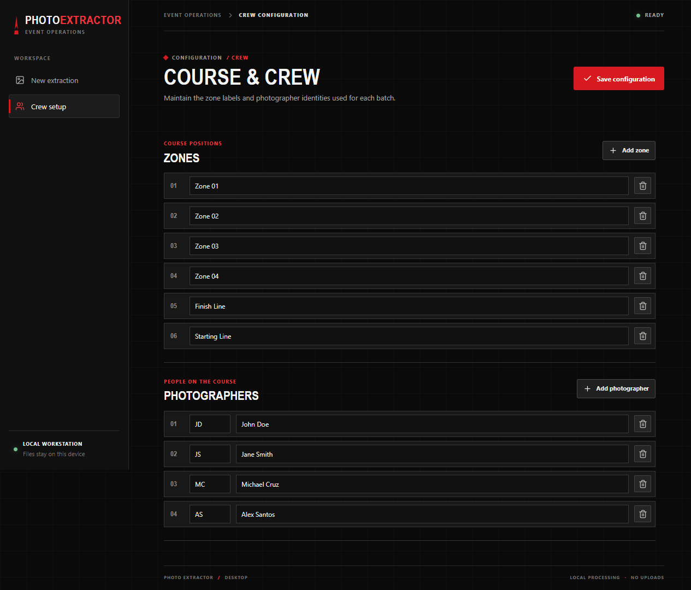
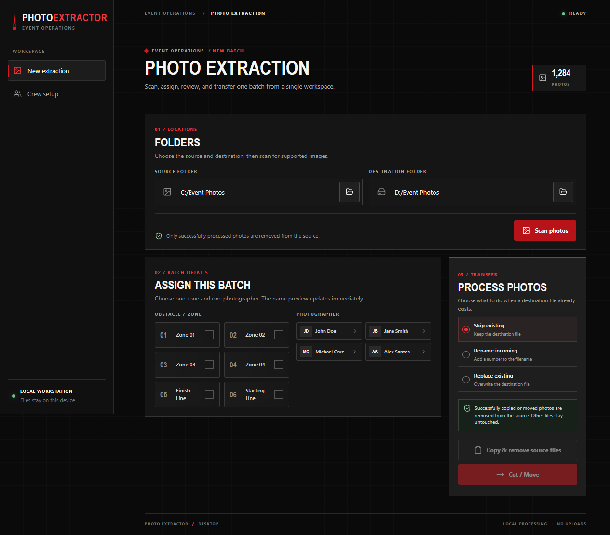
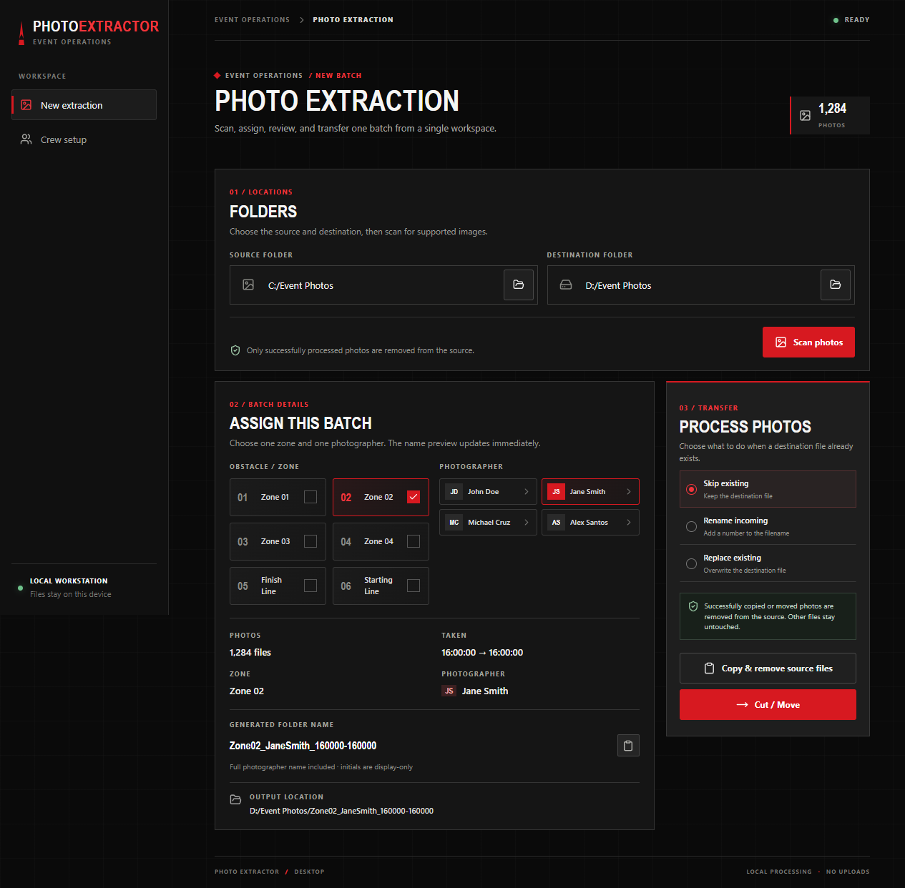
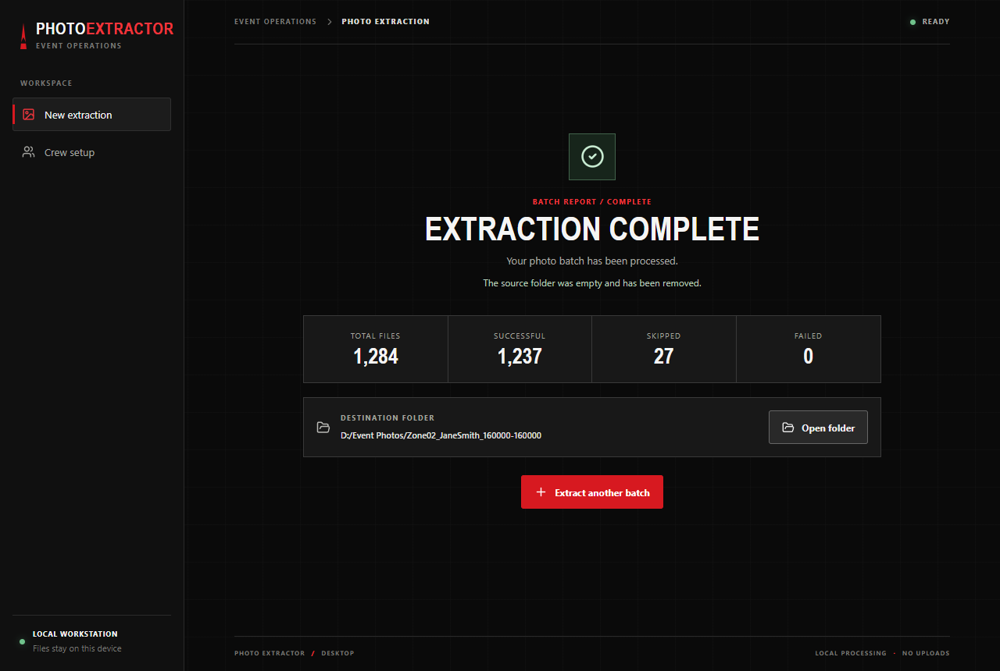

# Photo Extractor

Photo Extractor is a desktop app for organizing event photography batches without uploading anything to the cloud. It scans a source folder, reads image metadata, lets you assign a zone and photographer, and then copies or moves the selected files into a clean destination folder.

## Features

- Scan a folder recursively for JPG, JPEG, PNG, WEBP, HEIC, and HEIF files
- Read EXIF capture times when available and fall back to filesystem timestamps
- Assign each batch to a zone and photographer
- Generate a predictable destination folder name based on the selected batch
- Copy or move files while keeping your source folder tidy
- Handle duplicate files with skip, rename, or replace behavior
- Save crew configuration for zones and photographers
- Keep everything local on the workstation; no uploads required

## Requirements

- Node.js 20+
- npm

## Quick start

1. Install dependencies:

   ```sh
   npm install
   ```

2. Start the app in development mode:

   ```sh
   npm run dev
   ```

3. The app opens as a desktop window.

## How to use it

### 1) Configure zones and photographers

Before processing a batch, click the Crew setup tab in the left navigation and add the team members and zones you need.

The screenshots below are captured from the running app UI.



This is where you define:

- event zones such as Zone 01, Finish Line, or Starting Line
- photographers such as Jane Smith or Michael Cruz

These values are saved locally for future batches.

### 2) Pick the source and destination folders

On the main extraction screen, choose the folder that contains the photos and the folder where the organized output should be saved.



Use the Browse buttons to select:

- Source folder: where the incoming photos live
- Destination folder: the parent folder that will receive the extracted batch

### 3) Scan the source folder

Click Scan photos. The app recursively checks the source directory for supported image types and reads capture metadata as it goes.

You will see a progress panel while the scan completes. Once the scan finishes, the app shows how many supported photos were found.

### 4) Assign the batch

After scanning, choose:

- one zone
- one photographer

The app updates the generated folder name automatically.



The generated name is based on the selected zone and photographer, plus the photo time range captured in the batch. For example:

```text
ZONE02_JANE_SMITH_2024_10_31
```

You can copy the previewed folder name or use it directly as the destination folder.

### 5) Choose duplicate handling

In the transfer panel, choose how to react when the destination already has a file with the same name:

- Skip existing
- Rename incoming
- Replace existing

This keeps the workflow predictable when your event folders already contain prior exports.

### 6) Copy or move the batch

Choose one of the two actions:

- Copy & remove source files
- Cut / Move

If you choose Copy, the extracted photos are copied to the destination and the source files are removed only if they were processed successfully. If you choose Move, the app relocates the files.



### 7) Review the result

After processing, the app shows a summary with counts for:

- successful files
- skipped files
- failed files

It also shows the destination folder path and confirms whether the source folder was cleaned up.

## Supported file types

The app supports these image extensions:

- .jpg
- .jpeg
- .png
- .webp
- .heic
- .heif

## Project scripts

```sh
npm run dev
npm run build
npm run test
npm run typecheck
npm run package
npm run make
```

## Build and package

For a packaged desktop release, use:

```sh
npm run make
```

This creates a distributable for the current platform using Electron Forge.

## Notes

- The app stays local to the workstation.
- It does not upload photos to a remote service.
- The destination folder is created automatically if it does not exist.
- The source folder is only removed when it is empty after a successful extraction.

## Troubleshooting

- If no photos are found, make sure the source folder contains supported image files and try scanning again.
- If the batch name looks wrong, check that you assigned both a zone and a photographer.
- If a file transfer fails, review the result summary and the per-file failure details.

## License

This project is provided as-is for local event photo extraction workflows.
